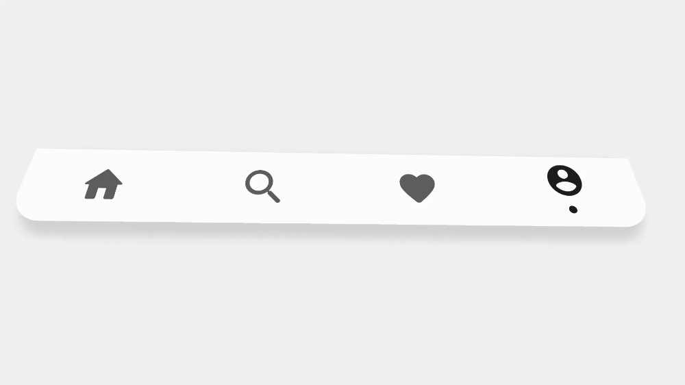
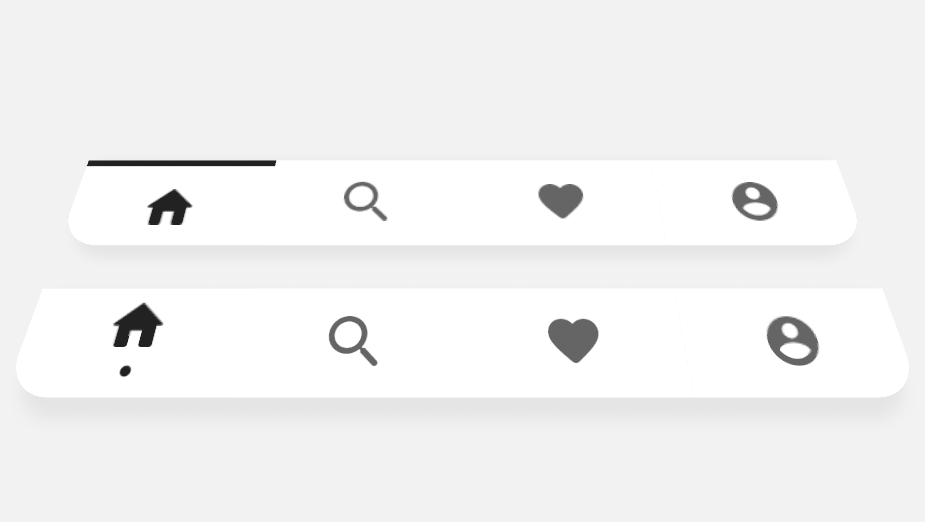

# Unity UI Tricks
Unity project with tips and tricks for UI in Unity. This project will work as a compilation of cool interactions/animations for UI I've done. Each trick includes a demo of use.

*This is a sample project made with Unity 2019.2.6 (but it should work on previous and following versions). You can use the included Unity Packages to use this tricks in other projects.*

### HOW TO USE:
1. Open the scene inside the folder of the trick you want to try.
2. Hit play!

 

### TRICK 1 - WAVE INTERACTION

Wave interaction indicated for interactive elements that are aligned with each other (Tabs or Navigation bars).

 
 

The project includes the free version of DOTween plugin (Copyright (c) 2014 Daniele Giardini - Demigiant) with all source code intact and with the proper copyright notices. For more about the plugin visit: http://dotween.demigiant.com/ .

Gustavo Carneiro (2021)
