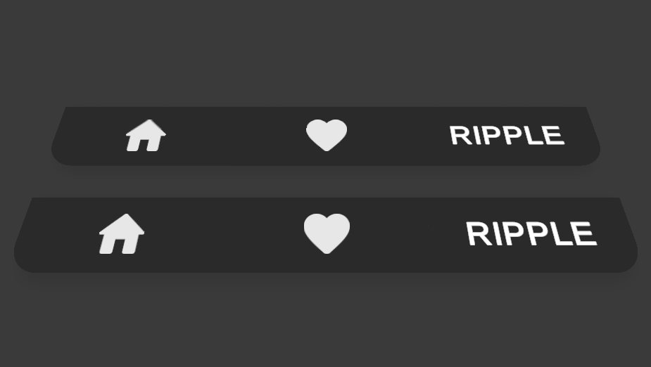
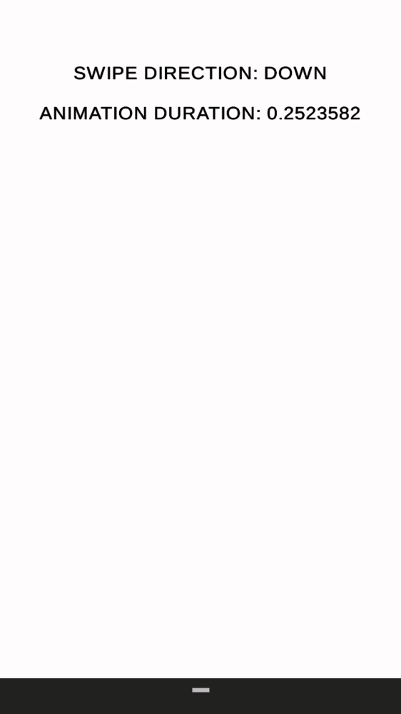

# Unity UI Tricks
Unity project with tips and tricks for UI in Unity. This project will work as a compilation of cool interactions/animations for UI I've done. Each trick includes a demo of use.

*This is a sample project made with Unity 2019.2.6 (but it should work on previous and following versions). You can use the included Unity Packages to use this tricks in other projects.*

### HOW TO USE:
1. Open the scene inside the folder of the trick you want to try.
2. Hit play!

 

### TRICK 1 - WAVE INTERACTION

Wave interaction indicated for interactive elements that are aligned with each other (Tabs or Navigation bars).

### TRICK 2 - RIPPLE EFFECT

Ripple effect when interacting with buttons or "clickable" elements, useful way of providing feedback about which elements are interactable. Inspired by Google Material Design.

### TRICK 3 - SWIPE/DRAG INTERACTION

Add a swipe/drag interaction to UI. This specific example is extended to replicate the behaviour of a notifications bar. The speed of the input, directly influences the speed and direction of the panel animation - Indicated for mobile use.

 
 

The project includes the free version of DOTween plugin (Copyright © Daniele Giardini - Demigiant 2014) with all source code intact and with the proper copyright notices. For more about the plugin visit: http://dotween.demigiant.com/ .

 

>Copyright © [Gustavo Carneiro](https://read.cv/gugucuquinha) 2020
